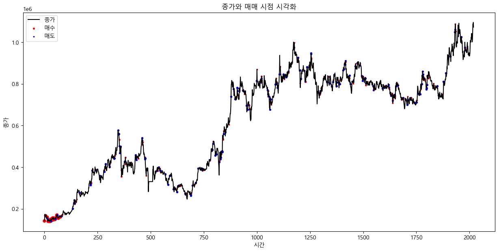

# Reinforced Trader using PPO 🚀

---

## 개요 📝

**Reinforced Trader using PPO**는 기술적 분석 📈과 강화학습 🤖의 결합으로 트레이딩 시뮬레이션을 진행하는 프로젝트입니다.  
이 프로젝트는 `ta` 패키지를 활용하여 다양한 기술적 분석 도구를 제공하며, Transformer 기반의 MLP와 PPO (Proximal Policy Optimization) 알고리즘을 통해 트레이딩 전략을 학습하고 최적화합니다.

---

## 프로젝트 특징 ⭐

- **기술적 분석**:  
  `ta` 패키지를 사용해 다양한 기술적 지표와 분석 도구를 제공합니다.  
  📊 여러 지표로 시장 현황을 분석
- **강화학습**:  
  PPO 알고리즘과 Transformer MLP 구조를 사용하여 효율적인 트레이딩 전략을 수립합니다.  
  🎯 최적의 의사결정을 위한 학습 과정

---

## 거래 방식 💰

- **거래량 조절**:  
  `policy`의 prob 값이 클수록 더 많은 거래가 이루어집니다.  
  초기 실험에서는 초반에 과도한 거래가 발생하는 문제를 보였습니다.
  
- **조정 방법**:  
  `gamma` 팩터를 사용하여 prob 값을 제곱함으로써 거래량을 완화하였습니다.  
  ⚖️ 이를 통해 보다 안정적인 거래 전략을 구현

💡 **Tip**: 과적합 현상이 빠르게 진행되는 문제를 발견하였습니다.  
초기에는 다량의 구매 후 소규모 매매가 반복되는 패턴이 나타나며,  
꾸준히 우상향하는 기업보다는 진동하는 기업들의 데이터 활용을 검토 중입니다.

---

## Visualization 📊



---

## 참고 자료 📚

- **Minimal PyTorch Implementation of Proximal Policy Optimization**  
  🔗 [GitHub Repository](https://github.com/nikhilbarhate99/PPO-PyTorch)
  
  ```bibtex
  @misc{pytorch_minimal_ppo,
      author = {Barhate, Nikhil},
      title = {Minimal PyTorch Implementation of Proximal Policy Optimization},
      year = {2021},
      publisher = {GitHub},
      journal = {GitHub repository},
      howpublished = {\url{https://github.com/nikhilbarhate99/PPO-PyTorch}},
  }